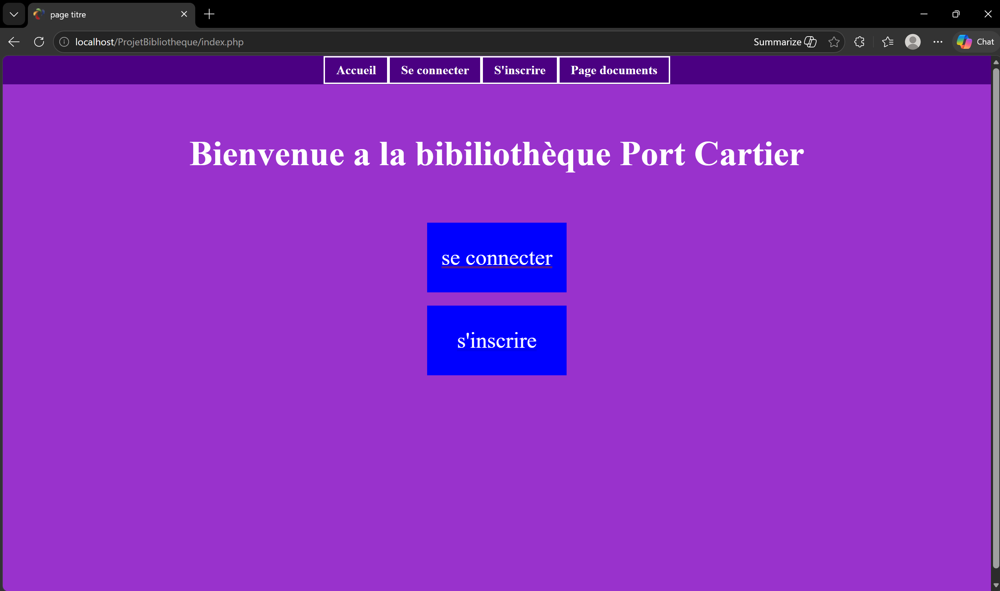
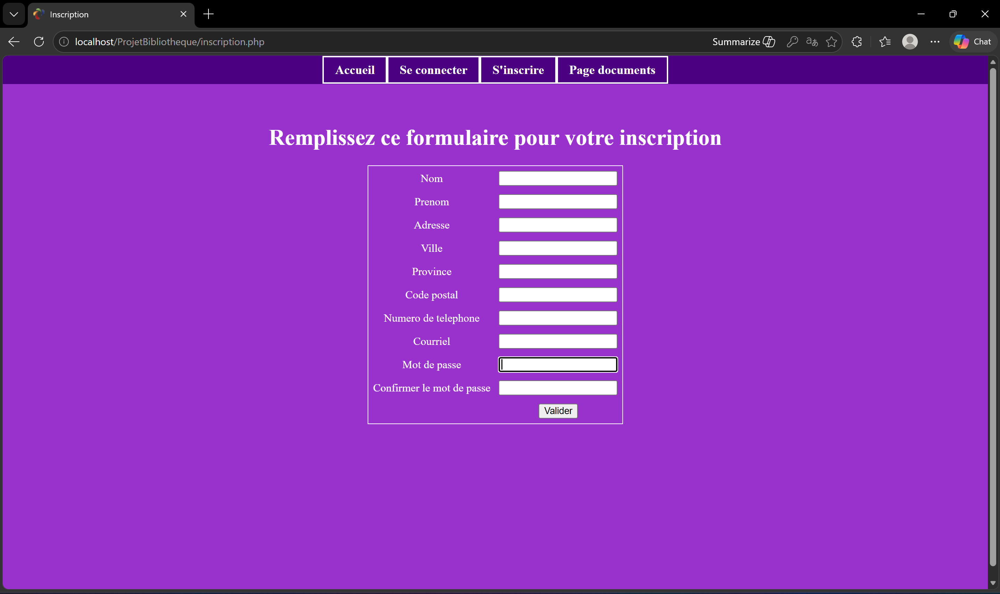
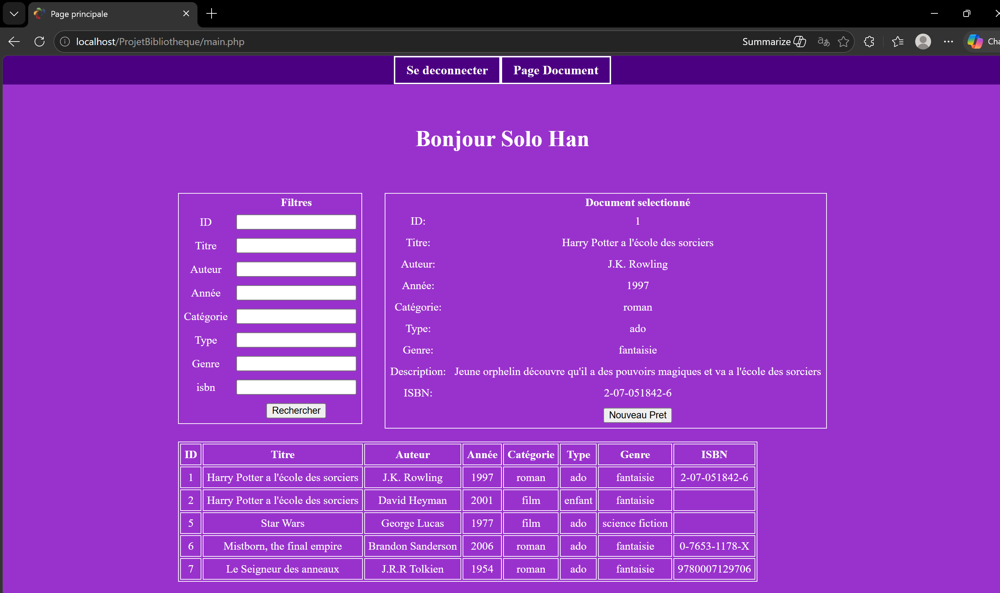
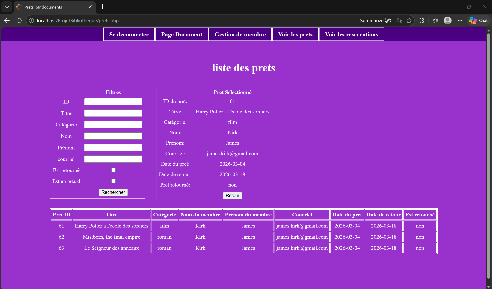
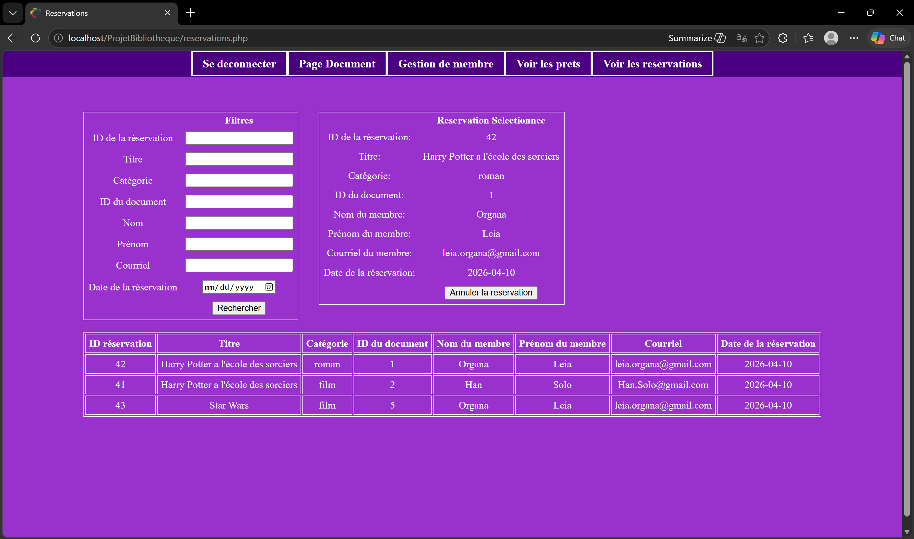
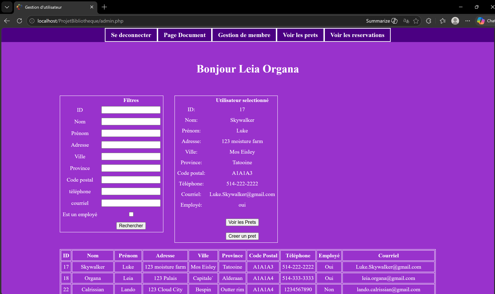

# Bibliothèque Port Cartier - Système de Gestion de Bibliothèque

## Description

Bibliothèque Port Cartier est un système de gestion de bibliothèque basé sur le web, conçu pour aider à gérer les livres, les emprunts et les réservations des utilisateurs. Cette application permet aux utilisateurs de s'inscrire, de se connecter et de gérer leurs interactions avec la bibliothèque, tandis que les administrateurs peuvent superviser les opérations de la bibliothèque.

## Fonctionnalités

- **Authentification des utilisateurs** : Système d'enregistrement et de connexion sécurisé
- **Gestion des emprunts** : Afficher et gérer les emprunts de livres
- **Réservations** : Réserver des livres pour un emprunt futur
- **Profils utilisateur** : Gérer les informations et préférences de l'utilisateur
- **Tableau de bord administrateur** : Contrôles administratifs pour la gestion de la bibliothèque
- **Design réactif** : Interface adaptée aux appareils mobiles

## Structure du projet

```
ProjetBibliothequeV4/
├── index.php              # Page d'accueil
├── connexion.php          # Page de connexion
├── inscription.php        # Page d'inscription
├── login.php              # Logique d'authentification et identifiants de base de données
├── main.php               # Tableau de bord principal (après connexion)
├── nouveauPret.php        # Formulaire de nouvel emprunt
├── prets.php              # Page de gestion des emprunts
├── reservations.php       # Gestion des réservations
├── admin.php              # Tableau de bord administrateur
├── fonctions.php          # Fonctions utilitaires pour les opérations de base de données
├── script.js              # Fonctionnalités JavaScript côté client
├── css/
│   └── style.css          # Style de l'application
└── README.md              # Documentation du projet (ce fichier)
```

## Prérequis

- PHP 7.0 ou supérieur
- MySQL ou base de données compatible
- Serveur web (Apache, Nginx, etc.)
- Navigateur web moderne

## Installation

### Étape 1 : Cloner ou télécharger le projet
Téléchargez le projet dans le répertoire de votre serveur web :
```bash
git clone https://github.com/gbelangermethot/ProjetBibliotheque
```

### Étape 2 : Créer la base de données
1. Ouvrez **phpMyAdmin** ou votre client MySQL préféré
2. Creer la base de données bibliotheque
3. Importer le fighier bibliotheque.sql pour creer les tables et importer les données de test


### Étape 3 : Configurer la connexion à la base de données
Modifiez les paramètres de connexion dans `login.php` :
```php
$host = 'localhost';           // Adresse du serveur MySQL
$data = 'bibliotheque';        // Nom de la base de données
$user = 'root';                // Utilisateur MySQL
$pass = 'votre_mot_de_passe'; // Mot de passe MySQL
$chrs = 'utf8mb4';             // Jeu de caractères
```

### Étape 4 : Démarrer le serveur web
- Assurez-vous que **Apache** (ou votre serveur web) et **MySQL** sont en cours d'exécution
- Accédez à l'application via votre navigateur : `http://localhost/ProjetBibliotheque/`

### Comptes de test disponibles
Après l'installation, utilisez ces comptes de test :

**Utilisateur standard :**
- Email : `Han.Solo@gmail.com`
- Mot de passe : HanSOlo

**Employe standard :**
- Email : `Luke.Skywalker@gmail.com`
- Mot de passe : LukeSkywalker

**Administrateur :**
- Email : `Leia.Organa@gmail.com`
- Mot de passe : LeiaOrgana

## Utilisation

### Pour les utilisateurs
1. Accéder à la page d'accueil (`index.php`)
2. Cliquer sur « Se connecter » ou « S'inscrire »
3. Après l'authentification, accéder à :
   - **Emprunts** (`prets.php`) - Afficher et gérer vos emprunts actuels
   - **Réservations** (`reservations.php`) - Faire de nouvelles réservations de livres
   - **Nouvel emprunt** (`nouveauPret.php`) - Créer une nouvelle demande d'emprunt

### Pour les Employés
1. Se connecter avec un compte employé
2. Accéder au tableau de employe (`admin.php`) pour :
   - Créer et retourner des prèts
   - Créer ou annuler des réservations
   - Voir et filter tout les utilisateurs
   - Voir et filter tout les prèts
   - Voir et filter toutes les réservations

### Pour les Administrateurs
1. Toutes les opérations employés
2. Creer de nouveaux employée en changeant le statut d'un utilisateur et lui donner les acces employés  
3. Retirer les privilèges employés au utilisateurs employés et le retourné au statu de utilisateur par défaut  

## Captures d'écran

### Page de connexion


### Page d'inscription


### Page de gestion des documents


### Gestion des prêts


### Gestion des réservations


### Gestion des membres (Administrateur)


## Aperçu des fichiers clés

- **login.php** : Contient les paramètres de connexion à la base de données et la configuration PDO
- **fonctions.php** : Fonctions utilitaires pour la validation des utilisateurs, l'enregistrement et les opérations de base de données
- **script.js** : Validation côté client et fonctionnalités interactives
- **style.css** : Style et mise en page de l'application

## Fonctionnalités de sécurité

- Hachage des mots de passe avec l'algorithme `PASSWORD_DEFAULT`
- Utilisation de déclarations préparées pour prévenir les injections SQL
- Gestion des sessions pour l'authentification des utilisateurs
- Validation des entrées de formulaire

## Technologies utilisées

- **Backend** : PHP (PDO pour l'abstraction de base de données)
- **Frontend** : HTML5, CSS3, JavaScript
- **Base de données** : MySQL/MariaDB
- **Serveur** : Apache ou serveur web compatible

## Améliorations futures

- Notifications par email pour les réservations
- Système de gestion des frais de retard
- Rappels de renouvellement d'adhésion
- Génération de rapports
- Améliorer la logique d'affichage 

## Licence

Ce projet a été développé dans le cadre du projet de cours 420-P12-ID.


**Dernière mise à jour** : avril 2026
